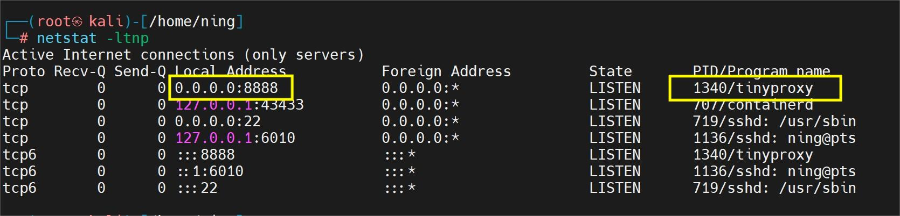
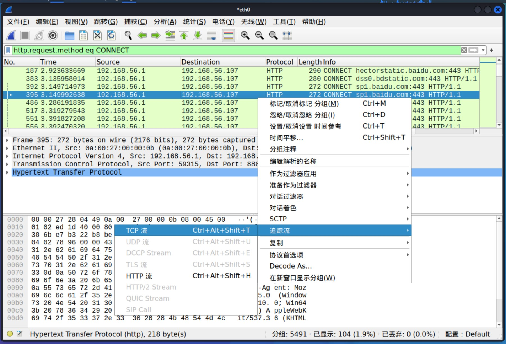

# HTTP代理服务器实验


## 实验环境

- 虚拟机：kali-rolling （192.168.56.107）
- 宿主机：Windows11 （192.168.1.103） 192.168.56.1

​	


## 实验内容

👌 实验验证：在Kali Linux中安装tinyproxy，然后用主机设置浏览器代理指向tinyproxy建立的HTTP正向代理，在Kali中用wireshark抓包，分析抓包过程，理解HTTP正向代理HTTPS流量的特点。

👌了解什么是HSTS


## 实验过程

- > **HTTP代理服务器实验**
  >
  > **Q：** 使用http代理服务器访问HTTPS站点时，通信传输内容是否会被代理服务器“看到”？
  >
  > **A：** 结论是代理服务器不知道客户端和服务器的HTTPS通信内容，但代理服务器知道客户端访问了哪个HTTPS站点，这是由http代理的协议机制决定的：代理客户端会发送Connect请求到http代理服务器。
  
  

### 1️⃣ 建立 HTTP 正向代理

- 在 kali 虚拟机上安装 tinyproxy

  ```bash
  # 安装 tinyproxy
  apt-get update
  apt-get install tinyproxy
  
  # 启动 tinyproxy
  sudo systemctl start tinyproxy
  ```

- 修改配置，因为host-only网卡与主机进行通信，所以要在 tinyproxy 中允许这192.168.0.0 一网段内的设备接入

  ```bash
  # 编辑tinyproxy，取消Allow 10.0.0.0/8行首注释
  vim /etc/tinyproxy/tinyproxy.conf
  # 取消下面两行的注释
  Allow 10.0.0.0/8
  Allow 192.168.56.0/24
  
  # 重启服务
  /etc/init.d/tinyproxy start
  
  # 设置虚拟机联网方式为Host-Only和NAT，默认tinyproxy监听8888端口
  ```
  
  
  
  > 务必保证你的修改与主机配置的网卡的子网掩码一致，否则将会出现一些异常现象
  
- 用主机设置浏览器代理指向 tinyproxy 建立的HTTP正向代理服务地址

  

- 查看 tinyproxy 端口情况

  ```bash
  netstat -ltnp
  ```

  


### 2️⃣ wireshark 抓包，分析结果

- kali 虚拟机里开启 wireshark 抓包，监控 eth0 、eth1网卡

  ```bash
  # 开启 wireshark 服务
  wireshark
  ```

- 其中，此处eth0网卡是用来连接宿主机和代理服务器的，eth1用来供代理服务器和目标网站服务器之间使用的。

  

- 分析抓包

  > wireshark 分析HTTP代理流量技巧：
  >
  > - http.request.method eq CONNECT 查看所有HTTPS代理请求
  > - http.request.method eq GET 查看所有HTTP GET代理请求
  > - [使用wireshark解密HTTPS流量的方法](http://support.citrix.com/article/CTX116557) [方法2](https://wiki.wireshark.org/SSL)
  > - 使用wireshark提取pcap包中的SSL证书
  >   - wireshark 首选项中确认 TCP 协议的 Allow subdissector to reassemble TCP streams 选项处于启用状态
  >   - 通过显示筛选过滤规则（例如：tcp.port == 443），找到 SSL 会话
  >   - 通过 packet list 里的 info 列找到 Certificate
  >     - 在 packet details 面板里依次展开Handshake Protocol: Certificate --> Certificates，如果有多个证书，会看到多个默认折叠起来的 Certificate
  >     - 右键选中 Certificate，在右键菜单里使用 Export Selected Packet Bytes 功能即可导出 DER 格式的 SSL 证书
  >   - 使用 openssl 命令行工具解析 DER 证书 openssl x509 -in xxx.der -inform der -text -noout

1. 对 eth0 抓取的流量使用 `http.request.method eq CONNECT 查看所有HTTPS代理请求`

   

   对 TCP 进行追踪流，观察到，其中的内容是被加密保护的，代理服务器无法查看到传输的具体内容。

   

   

2. 对 eth1 抓取的流量使用 `http.request.method eq GET 查看所有HTTP GET代理请求`，然后同时follow流。

   

   可以看到这是发到`courses.cuc.edu.cn` 的数据包

   

   从图上可以得到包括明文 Cookie 等一系列的内容，可以说在 http 协议下使用代理服务器是极为不安全的操作。

##   总结

- 使用http代理服务器访问HTTPS站点时，代理服务器知道客户端访问的HTTPS站点
- 代理服务器不知道客户端和服务器的HTTPS通信内容
- 代理客户端会发送Connect请求到http代理服务器

##   参考文章

- [网络安全线上课本](https://c4pr1c3.github.io/cuc-ns/chap0x03/exp.html)
- [2021-ns-public-Tbc-tang/0x03.md ](https://github.com/CUCCS/2021-ns-public-Tbc-tang/blob/chap0x03/0x03.md) 

  