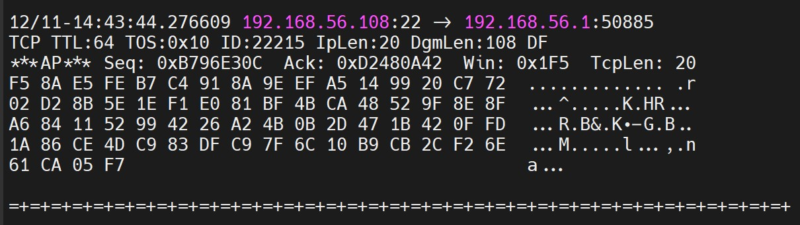
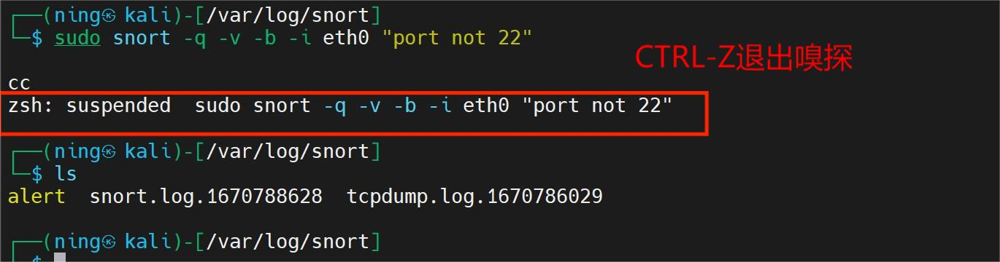
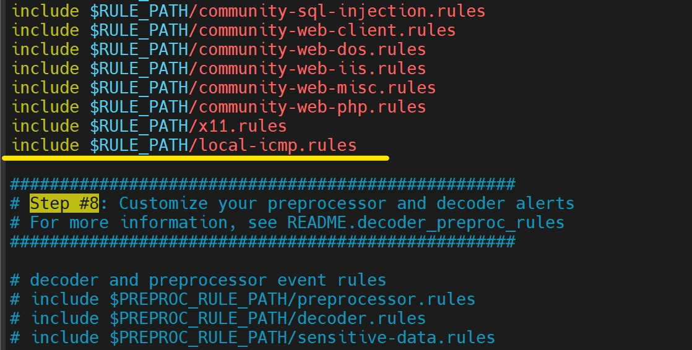

# 实验九 入侵检测


## 实验拓扑

- VM-1 ：kali-rolling attackter (eth0: 192.168.56.107) 
- VM-2：kali-rolling victim (eth0: 192.168.56.108) 
- 网络：Host-only网络 ，内部网络intnet1 ,  Nat网络

## 实验内容

- 安装 Snort
- 有关 Snort 的四项实验
- 安装 guardian


## 实验步骤

### Snort 实验

#### 安装 Snort

```shell
# 禁止在apt安装时弹出交互式配置界面
export DEBIAN_FRONTEND=noninteractive

# 安装，本次实验在VM-2上，需要对apt源进行配置
sudo apt install snort

# 由于Kali-rolling 本身无法直接用apt install安装snort
# 添加 apt 源
  sudo vim /etc/apt/sources.list
# 添加源
  deb http://http.kali.org/kali sana main non-free contrib
  deb http://security.kali.org/kali-security sana/updates main contrib non-free
  deb http://old.kali.org/kali moto main non-free contrib
  
# 默认snort是对eth0网卡进行嗅探，需要在首次安装时注意修改
```

#### 实验一：配置snort为嗅探模式

```bash
# 显示IP/TCP/UDP/ICMP头
snort -v

# 显示应用层数据
snort -vd

# 显示数据链路层报文头
snort -vde

```





```shell
# -b 参数表示报文存储格式为 tcpdump 格式文件
# -q 静默操作，不显示版本欢迎信息和初始化信息
snort -q -v -b -i eth0 "port not 22"

# 使用 CTRL-C 退出嗅探模式
# 实验建议使用root用户身份进行实验
# 普通用户使用 sudo snort -q -v -b -i eth0 "port not 22" 无法利用Ctrl-C退出嗅探模式，可以用Ctrl-Z退出嗅探模式

# 嗅探到的数据包会保存在 /var/log/snort/snort.log.<epoch timestamp>
# 其中<epoch timestamp>为抓包开始时间的UNIX Epoch Time格式串
# 可以通过命令 date -d @<epoch timestamp> 转换时间为人类可读格式
# 上述命令用tshark等价实现如下：
tshark -i eth0 -f "port not 22" -w <filename>.pcap
```




```shell
#由于用户权限限制，可以将文件重命名后保存在其他路径
sudo cp <filename> <path>/<filename2>
#授予普通用户权限，可用wireshark正常打开
sudo chmod 777 <path>/<filename2>
```


wireshark 打开情况如下：

- 普通用户


- root 用户


#### 实验二：配置并启用snort内置规则

- Snort 的配置文件路径为 `/etc/snort/snort.conf ` ，[参考文章 ](https://blog.csdn.net/baidu_19348579/article/details/121337818) 帮助理解配置文件内容。

```shell
# /etc/snort/snort.conf 中的 HOME_NET 和 EXTERNAL_NET 需要正确定义
# 学习实验目的，可以将上述两个变量值均设置为 any
```

- Set the network variables 配置网络变量

```shell
#设置要保护的网络地址
ipvar HOME_NET any

#设置外部网络地址。在大多数情况下保留为 any
ipvar EXTERNAL_NET any
```


此处配置文件中，变量包含三种：

> 1.ipvar		用来定义一组IP， 这种定义可以是一个IP，几个IP，一段IP，并配合取反，并集等操作
> 2.portvar	用来定义一组端口， 这种定义也可以是一个端口，几个端口，端口范围，并配合取反，并集等操
> 3.var		用来定义一个普通变量

- 对于snort具体参数的使用理解

```shell
# 示例
snort -q -A console -b -i eth0 -c /etc/snort/snort.conf -l /var/log/snort/

# 参考帮助文档
snort --help

# Options:
#   -A       Set alert mode: fast, full, console, test or none  (alert file alerts only)
#            "unsock" enables UNIX socket logging (experimental).
#			 设置报警模式

# 	-q       Quiet. Don't show banner and status report

# 	-b       Log packets in tcpdump format (much faster!)

#	-i <if>  Listen on interface <if>

# 	-c <rules> Use Rules File <rules>

#	-l <ld>    Log to directory <ld>

```

####  

#### 实验三：自定义snort规则

- 在VM-2虚拟机上配置snort规则

  ```bash
  # 新建自定义 snort 规则文件
  cd /etc/snort/rules/
  vim local-icmp.rules
  # 添加规则：检测来自局域网内大于800的数据包
  alert icmp $EXTERNAL_NET any -> $HOME_NET any (msg:"Note! ICMP Large ICMP Packet"; dsize:>800; reference:arachnids,246; classtype:bad-unknown; sid:499; rev:4;)
  ```

  

- ```bash
  # 添加配置代码到 /etc/snort/snort.conf
  include $RULE_PATH/local-icmp.rules
  ```

  

- 开启snort监听

  ```bash
  snort -q -A fast -b -i eth0 -c /etc/snort/snort.conf -l /var/log/snort/
  ```

- 在 VM-1 上对 VM-2 进行包大于 800 的pin攻击

  ```bash
  ping 192.168.56.107 -s <packageSize>
  ```

  

- 观察 /var/log/snort/alert 日志，可以看到有报警信息

  


#### 实验四：和防火墙联动

- 下载并解压缩实验脚本代码

  ```bash
  # 下载脚本代码
  wget https://c4pr1c3.github.io/cuc-ns/chap0x09/attach/guardian.tar.gz
  # 解压缩 Guardian-1.7.tar.gz
  tar zxf guardian.tar.gz
  
  # 安装 Guardian 的依赖 lib
  apt install libperl4-corelibs-perl
  ```

- 检测两台主机 VM-1 和 VM-2之间的连通性，可以实现双向访问

  - VM-1 ：eth0: 192.168.56.107
  - VM-2： eth0: 192.168.56.108

  

- 在VM-2上先后开启 `snort` 和 `guardian.pl`

  ```bash
  # 开启 snort
  snort -q -A fast -b -i eth0 -c /etc/snort/snort.conf -l /var/log/snort/
  ```

  到 guardian.tar.gz 解压缩后文件目录 /guardian 下，编辑 guardian.conf 并保存，确认以下2个参数的配置符合主机的实际环境参数。

  ```bash
  HostIpAddr      192.168.56.108
  Interface       eth0
  ```

  

  ```bash
  # 启动 guardian.pl
  perl guardian.pl -c guardian.conf
  ```

  注意，如果启动 guardian 出现 LogFile 无法写入的错误，到 LogFile 对应目录下手动创建，LogFile 存储位置见 guardian.conf 。

  

  ```bash
  # 创建 log 文件
  touch /var/log/guardian.log
  ```

  

- 在VM-1上用 `nmap` 暴力扫描 VM-2：

  ```bash
  nmap 192.168.56.108 -A -T4 -n -vv
  ```

- 观察 iptables 前后规则，可以看到 iptables 在开启实验前后确实有规则的增加。

  

  此时，再在 VC-1 上对VC-2进行ping，无法ping通，因为这时防火墙添加了规则，使得 ping 包无法通过。

  

  


## 参考文件

- [网络入侵检测--Snort软件配置文件snort.conf](https://blog.csdn.net/baidu_19348579/article/details/121337818)
- [unable-to-locate-package-snort-kali](https://unix.stackexchange.com/questions/594935/unable-to-locate-package-snort-kali-linux-in-vmware-workstation-pro-ver-15-5-6)